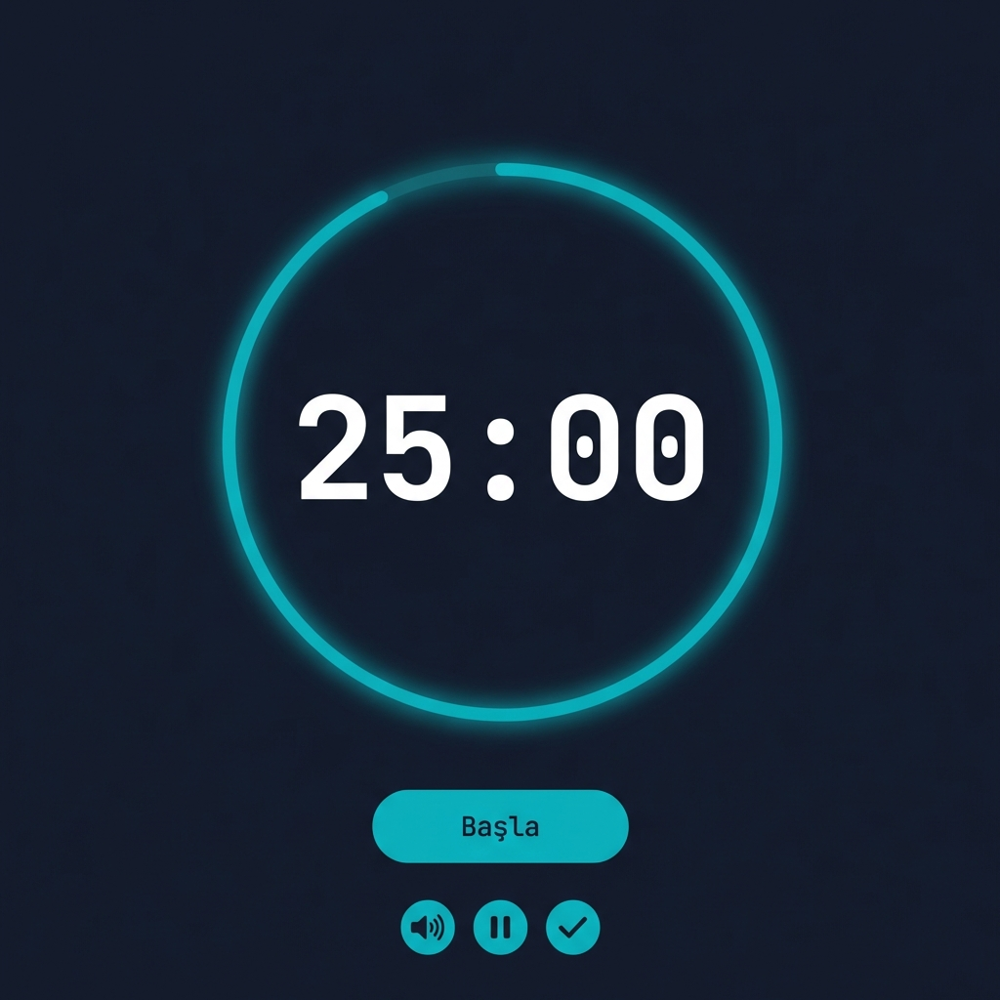

# Odaklan! 🎯

Minimalist Pomodoro zamanlayıcı uygulaması. Odaklanmanızı artırın, üretkenliğinizi katlayın.


<p align="center">
  
</p>

## ✨ Özellikler

### Temel Özellikler
- **🕐 Pomodoro Zamanlayıcı** - 25 dakikalık odak seansları
- **☕ Kısa Mola** - Her pomodoro sonunda 5 dakika mola
- **🎯 Uzun Mola** - Her 4 pomodoro sonunda 15 dakika mola
- **🎯 Odak Modu** - Zamanlayıcı çalışırken dikkat dağıtıcı elemanlar otomatik soluklaşır
- **⏩ İleri Sar** - Seansı anında tamamlayın (gerçek geçen süre sayılır, hile yapılamaz!)

### Ambient Sesler
- **🔇 Sessiz Mod**
- **🌧️ Yağmur Sesi** - Rahatlatıcı yağmur ambiyansı
- **☕ Kafe Sesi** - Kahve dükkanı atmosferi
- **🔔 Akıllı Ses Yönetimi** - Seans bitince ambient sesler otomatik durur

### Akıllı Bildirimler (Soft Prompt)
- **🔔 Kullanıcı Kontrollü İzin** - "Başla"ya basınca değil, siz istediğinizde bildirim izni istenir (Soft Prompt).
- **🚫 Engelli Durum Yönetimi** - Tarayıcıdan yanlışlıkla engellerseniz manuel düzeltme rehberi sunar.
- **🎨 Dinamik Favicon** - Mod değişiminde sekme ikonu değişir
  - 🔵 Turkuaz (Odak) | 🟢 Yeşil (Kısa Mola) | 🟣 Mor (Uzun Mola)
- **⏱️ Dinamik Sekme Başlığı** - Kalan süre sekme başlığında görünür: `(12:45) 🎯 Odak`
- **📢 Başlık Yanıp Sönme** - iOS dahil tüm platformlarda çalışan bildirim

### Takip & Paylaşım
- **📊 Günlük Takip** - LocalStorage ile günlük odak sürenizi takip edin
- **🔄 Sekme Senkronizasyonu** - Birden fazla sekmede açıksa veriler senkronize kalır
- **📤 Paylaşım Kartı** - Başarınızı PNG olarak indirip sosyal medyada paylaşın
- **📱 Responsive Tasarım** - iOS Safari dahil tüm cihazlarda mükemmel görünüm (100dvh desteği)

### Teknik Özellikler
- **💤 Uyku Modu Dayanıklı** - Bilgisayar uyku moduna girse bile zamanlayıcı doğru çalışır
- **🛡️ Hile Koruması** - Skip ile pomodoro sayacı artmaz, çift sayım hatası yok
- **📐 Clean Code** - Magic number yok, tüm sabitler tek yerde tanımlı

## 🚀 Kurulum

Proje tamamen statik olduğu için herhangi bir kurulum gerektirmez:

```bash
# Repoyu klonlayın
git clone https://github.com/atakankarakas/Odaklan.git

# Klasöre girin
cd Odaklan

# index.html dosyasını tarayıcınızda açın
```

## 📁 Proje Yapısı

```
Odaklan/
├── index.html          # Ana uygulama dosyası (HTML + CSS + JS)
├── assets/
│   └── sounds/
│       ├── rain.mp3      # Yağmur ambient sesi
│       ├── cafe.mp3      # Kafe ambient sesi
│       ├── complete.mp3  # Odak bitiş sesi
│       └── break-end.mp3 # Mola bitiş sesi
├── preview.png         # GitHub önizleme görseli
├── README.md
└── LICENSE
```

## 🎨 Tasarım Dili

**Atakan UI** tasarım sistemi:

| Özellik | Değer |
|---------|-------|
| Arka Plan | `#0f172a` (Slate 900) |
| Metin Rengi | `#e2e8f0` (Slate 200) |
| Odak Rengi | `#00B7C6` (Türk Turkuazı) |
| Kısa Mola | `#22c55e` (Yeşil) |
| Uzun Mola | `#8b5cf6` (Mor) |
| Sayaç Fontu | JetBrains Mono |
| Metin Fontu | Inter |

## ⌨️ Klavye Kısayolları

| Tuş | İşlev |
|-----|-------|
| `Space` | Başlat / Durdur |
| `Escape` | Durdur / Modalı kapat |
| `R` | Sıfırla |

## 🔄 Pomodoro Döngüsü

```
🎯 Odak (25dk) → ☕ Kısa Mola (5dk) → 🎯 → ☕ → 🎯 → ☕ → 🎯 → 🌴 Uzun Mola (15dk) → tekrar...
```

## 🛠️ Teknolojiler

- **HTML5** - Yapı
- **JavaScript (Vanilla)** - Uygulama mantığı
- **Tailwind CSS** - Styling (CDN)
- **Font Awesome** - İkonlar (CDN)
- **html2canvas** - Paylaşım kartı oluşturma (CDN)
- **Google Fonts** - JetBrains Mono & Inter
- **Web Notifications API** - Tarayıcı bildirimleri
- **Storage Event API** - Sekme senkronizasyonu

## 📝 Lisans

MIT Lisansı - [LICENSE](LICENSE)

## 💝 Destek

Bu proje bağış usulü ile desteklenmektedir. Gelirin %10'u **Mehmetçik Vakfı** ile paylaşılmaktadır.

## 👨‍💻 Geliştirici

**Atakan Karakaş** - [@atakankarakas](https://github.com/atakankarakas)

---

<p align="center">Made with ❤️ in Turkey</p>
